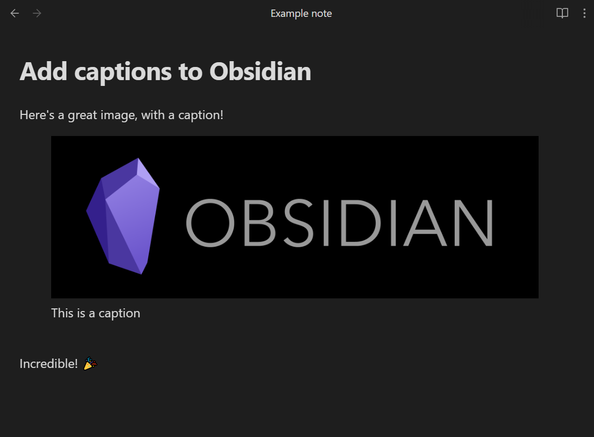

  

# Add image captions

Add an image in this format:

```markdown
![[image.jpg|This is a caption]]
```

or this format:

```markdown

```

and it will add the caption underneath the image, like this:



## Resize images

You can use the existing Obsidian width parameter to resize your images:

```markdown
![[image.jpg|This is a caption|150]]
```

or this format:

```markdown

```

## Markdown in captions

You can include inline Markdown and it will be rendered as part of the caption:

```markdown
![[image.jpg|This is a caption with **bold text**]]
```

You can use Markdown links as normal:

```markdown
]]
```

To use Wikilinks, you'll need to swap your square brackets `[[]]` for angle brackets `<<>>`:

```markdown
![[image.jpg|This is a caption with <<a Wikilink>>]]
```

## Use filename as caption

If you want to use the image filename as the caption, specify `%` as the sole text of your 
caption, and it will replace that with the filename (without extension):

```markdown
![[image.jpg|%]]
```

If you want to literally use the `%` character as the caption, you can escape it:

```markdown
![[image.jpg|\%]]
```

If you want the filename including extension, use `%.%`.

## Custom regex to filter caption

If you use other themes or plugins which require you to add data into the image description field, you can use a 
regex to remove those from the final caption. You will find this in the plugin Settings.

Two common examples would be from the ITS Theme, which lets you put `|right` etc to change the postion of your image.

To remove everything after the first pipe `|` character from your caption:

```
^([^|]+)
```

If you want to keep escaped pipes `\|` (in case you are using internal links), use:

```
^((\\\||[^|])+)
```

## Styling

You can apply CSS styling by targeting the `.image-captions-figure` and `.image-captions-caption` classes.

## Limitations

The captions won't show for external images in **Editing / Live Preview** mode. For example:

```markdown

```

I couldn't find a reliable way of targeting them. Get in touch if you know a way to do this!

---

This plugin is based on concepts from https://github.com/bicarlsen/obsidian_image_caption
